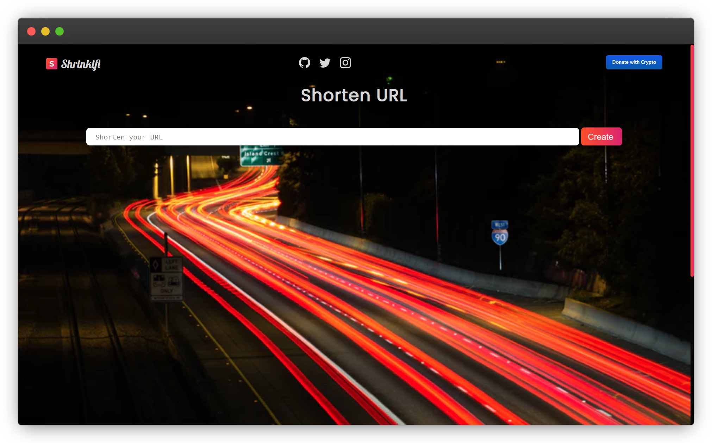
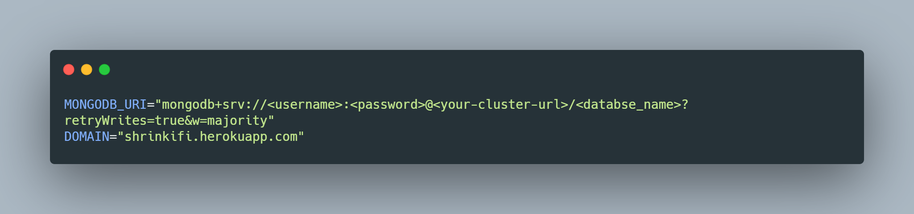

<div align="center">

<br>

<br>


<a href="https://shrinkifi.herokuapp.com"></a >

<a href="https://heroku.com/deploy?template=https://github.com/krishaayjois21/shrinkifi/">
</a>
<a href="https://github.com/krishaayjois21/shrinkifi/blob/main/LICENSE"></a>
<a href="https://github.com/krishaayjois21/shrinkifi/network/members">
</a>
<a href="https://github.com/krishaayjois21/shrinkifi/stargazers"></a>


<br>

</div>
<hr>

# Setup

## Prerequisites
- [NodeJS](https://nodejs.org/en/)

## Environment Setup
- Create a MongoDB Cluster. [Here](https://www.youtube.com/watch?v=rPqRyYJmx2g) is a video tutorial
- Copy you connection URI/URL for NodeJS and note it down
- Create a `.env` file in the root of the project
- Also note down your domain name (if you are using heroku it will be `<app-id>.herokuapp.com`)
- Enter the following data into the `.env` file
```d
MONGODB_URI="mongodb+srv://<username>:<password>@<your-cluster-url>/<databse_name>?retryWrites=true&w=majority"
DOMAIN="<app-name>.herokuapp.com"
```

**Sample `.env` file**


## Node Setup
- Install all dependencies `npm install`
- To run the app with nodemon: `npm run develop`
- To run the app without nodemon: `npm start`
- Open `locahost:5000` on your browser
 
*and you are good to go!*

